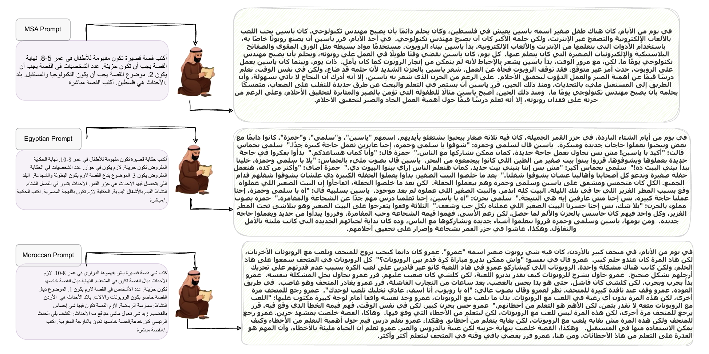

# AraStories: Arabic Automatic Story Generation with Large Language Models


This repository contains the code and data related to our paper [Arabic Automatic Story Generation with Large Language Models
](https://arxiv.org/abs/2407.07551), published on the 2nd edition of ArabicNLP conference, Co-located with ACL 2024 Bangkok, Thailand.

## Overview

**AraStories** is a comprehensive set of models and datasets designed to facilitate research in the area of story generation for MSA and its different dialects (e.g., Egyptian and Moroccan in this work). The dataset includes a wide variety of stories and corresponding prompts that challenge models to exhibit a deep performance of Arabic story generation structures and common knowledge in the Arabic language.

## Contents

- `data/`: Contains the AraStories dataset in CSV formats.
- `src/`: Source code for preprocessing, training, and evaluation.
- `models/`: Pre-trained models and checkpoints.
- `notebooks/`: Jupyter notebooks for data exploration and analysis.
- `Results/`: Results and evaluation metrics.

## Dataset

The AraStories dataset consists of 3 CSV files, each file contains one of the three Arabic varieties covered in our work: Modern Standard Arabic(MSA), Egyptian, and Moroccan. Each file contains two columns:

- **Story**: A diverse collection of Arabic stories from various genres and sources.
- **Prompt**: Prompts used to generate those stories.

### Download

You can download the dataset from the data folder in this GitHub repo.


## Getting Started

### Prerequisites

- Python 3.10+
- Required Python libraries are listed in `requirements.txt`.

### Installation

1. Clone the repository:
   ```sh
   git clone https://github.com/UBC-NLP/arastories.git
   cd arastories
   ```

2. Install the required packages:
   ```sh
   pip install -r requirements.txt
   ```

### Usage

#### Preprocessing

To preprocess the data, run the following command:
```sh
python src/preprocess.py --input data/raw --output data/processed
```

#### Training

To train a model on the AraStories dataset, use:
```sh
python src/train.py --config configs/train_config.json
```

#### Evaluation

To evaluate a trained model, run:
```sh
python src/evaluate.py --model models/model_checkpoint.pth --data data/processed
```

### Jupyter Notebooks

Explore the dataset and results using the provided Jupyter notebooks in the `notebooks/` directory.

## Results

We provide benchmark results for various models trained on the AraStories dataset. Detailed results and evaluation metrics are available in the `results/` directory.

## Citation

If you use AraStories in your research, please cite our paper:

```bibtex
@misc{elshangiti2024arabicautomaticstorygeneration,
      title={Arabic Automatic Story Generation with Large Language Models}, 
      author={Ahmed Oumar El-Shangiti and Fakhraddin Alwajih and Muhammad Abdul-Mageed},
      year={2024},
      eprint={2407.07551},
      archivePrefix={arXiv},
      primaryClass={cs.CL},
      url={https://arxiv.org/abs/2407.07551}, 
}
```

## License

This project is licensed under the MIT License - see the [LICENSE](LICENSE) file for details.

## Ethical Considerations
Similar to other generative models, our model can reflect the bias in its data. Any use of the model should take this into account.

## Acknowledgments

We acknowledge support from Canada Research Chairs (CRC), the Natural Sciences and Engineering Research Council of Canada (NSERC; RGPIN2018-04267), the Social Sciences and Humanities Research Council of Canada (SSHRC; 435-2018-0576; 895-2020-1004; 895-2021-1008), Canadian Foundation for Innovation (CFI; 37771), Digital Research Alliance of Canada, and UBC ARCSockeye.

---

